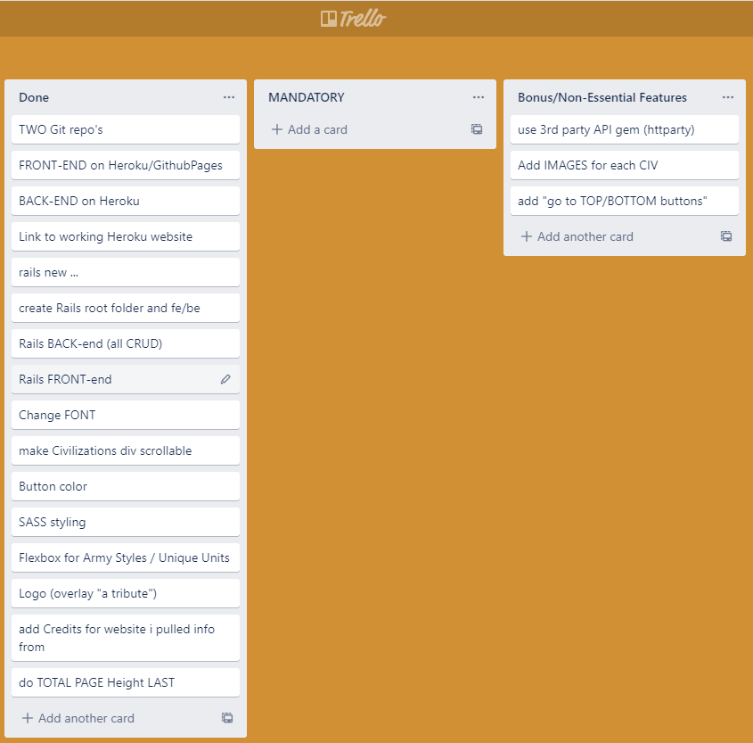
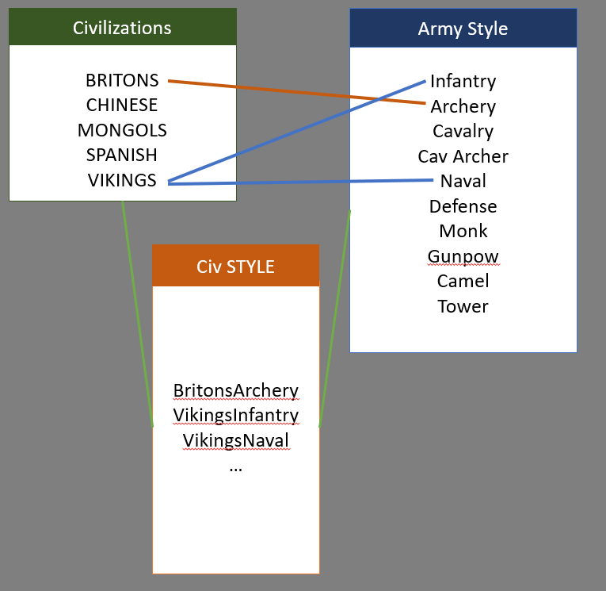

# Age of Empires: Quick Reference
A web app that lists all the civilizations from the Age of Empires video game, so gamers can quickly check which type of strategic focus and unique units they have.

## Technologies Used
* JavaScript
* React.js, 
* Ruby on Rails
* CORS
* SASS

## Approach Taken

## Unsolved problems
* Initially had a **one-to-many, through** relationship but eventually started over because I couldn't get certain items to render.
* I THINK it would have worked and the problem wasn't with the relationships but, instead, was with the arrays (which I later fixed).

## Wireframe / Planning

Trello Board:

[Original] Relationship:

## Link to the Website
* Back-end: https://aoe-tribute-api.herokuapp.com/
* Front-end: https://aoe-tribute-client.herokuapp.com/
